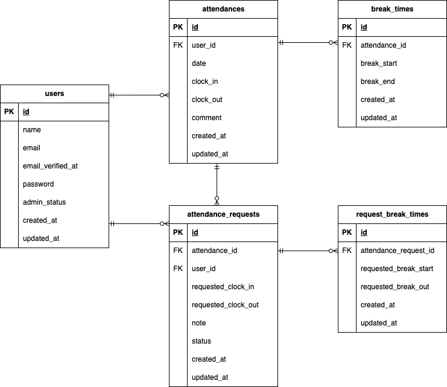

# 勤怠管理アプリ

勤怠管理アプリです。

## 環境構築

Dockerビルド

1.  git clone https://github.com/YumiOotake/Attendance-Management-test.git
2.  プロジェクト直下で、以下のコマンドを実行する

```
make init
```

3.  .envファイル作成後、以下を編集：
```
DB_CONNECTION=mysql
DB_HOST=mysql
DB_PORT=3306
DB_DATABASE=laravel_db
DB_USERNAME=laravel_user
DB_PASSWORD=laravel_pass
```

4.  DBのマイグレーションとシーダーを実行する

```
make fresh
```

## メール認証設定（Mailtrap）

1. [Mailtrap](https://mailtrap.io)にアクセスしてアカウント登録
2. Email Testing → Inboxes → 自分のInboxを選択
3. SMTP Settings → Integrations で「Laravel 8+」を選択
4. 表示された内容を`.env`に設定

以下を編集：

```
MAIL_MAILER=smtp
MAIL_HOST=sandbox.smtp.mailtrap.io
MAIL_PORT=2525
MAIL_USERNAME=your_username
MAIL_PASSWORD=your_password
MAIL_ENCRYPTION=tls
MAIL_FROM_ADDRESS="hello@example.com"
MAIL_FROM_NAME="${APP_NAME}"
```

## テスト実行

テストはMySQLではなく、phpunit.xmlのsqlite(in-memory)で実行されます

1. docker-compose exec php bash
2. php artisan test --testsuite=Feature

## 使用技術(実行環境)

- PHP 8.1
- Laravel 8.83.8
- Nginx 1.21.1
- MySQL 8.0
- phpMyAdmin
- Docker / Docker Compose

## テーブル仕様
### usersテーブル
| カラム名 | 型 | primary key | unique key | not null | foreign key |
| --- | --- | --- | --- | --- | --- |
| id | bigint | ◯ |  | ◯ |  |
| name | varchar(255) |  |  | ◯ |  |
| email | varchar(255) |  | ◯ | ◯ |  |
| email_verified_at | timestamp |  |  |  |  |
| password | varchar(255) |  |  | ◯ |  |
| remember_token | varchar(100) |  |  |  |  |
| created_at | timestamp |  |  |  |  |
| updated_at | timestamp |  |  |  |  |

### attendancesテーブル
| カラム名 | 型 | primary key | unique key | not null | foreign key |
| --- | --- | --- | --- | --- | --- |
| id | bigint | ◯ |  | ◯ |  |
| user_id | bigint |  |  | ◯ | users(id) |
| date | date |  |  | ◯ |  |
| clock_in | time |  |  |  |  |
| clock_out | time |  |  |  |  |
| comment | varchar(255) |  |  |  |  |
| created_at | timestamp |  |  |  |  |
| updated_at | timestamp |  |  |  |  |

### break_timesテーブル
| カラム名 | 型 | primary key | unique key | not null | foreign key |
| --- | --- | --- | --- | --- | --- |
| id | bigint | ◯ |  | ◯ |  |
| attendance_id | bigint |  |  | ◯ | attendances(id) |
| break_start | time |  |  |  |  |
| break_end | time |  |  |  |  |
| created_at | timestamp |  |  |  |  |
| updated_at | timestamp |  |  |  |  |

### attendance_requestsテーブル
| カラム名 | 型 | primary key | unique key | not null | foreign key |
| --- | --- | --- | --- | --- | --- |
| id | bigint | ◯ |  | ◯ |  |
| attendance_id | bigint |  |  | ◯ | attendances(id) |
| user_id | bigint |  |  | ◯ | users(id) |
| requested_clock_in | time |  |  |  |  |
| requested_clock_out | time |  |  |  |  |
| note | text |  |  | ◯ |  |
| status | integer |  |  | ◯ |  |
| created_at | timestamp |  |  |  |  |
| updated_at | timestamp |  |  |  |  |

### request_break_timesテーブル
| カラム名 | 型 | primary key | unique key | not null | foreign key |
| --- | --- | --- | --- | --- | --- |
| id | bigint | ◯ |  | ◯ |  |
| attendance_request_id | bigint |  |  | ◯ | attendance_requests(id) |
| requested_break_start | time |  |  |  |  |
| requested_break_end | time |  |  |  |  |
| created_at | timestamp |  |  |  |  |
| updated_at | timestamp |  |  |  |  |

## ER図



## 追加エラーメッセージ

ログイン
- メールアドレスはメール形式で入力してください

勤怠詳細を確認/申請
- 時刻は「09:00」の形式で入力してください
- 備考は文字列で記入してください
- 備考は255文字以内で記入してください
- 休憩開始時刻を入力してください
- 休憩終了時刻を入力してください

## URL

- 開発環境トップ：http://localhost/attendance
- 一般ユーザーログイン：http://localhost/login
- 管理者ログイン：http://localhost/admin/login
- phpMyAdmin：http://localhost:8080/

## ユーザー情報

- ユーザー1（一般）: user1@example.com / password / メール認証済み
- ユーザー2（一般）: user2@example.com / password / メール認証済み
- ユーザー3（管理者）: user3@example.com / password / メール認証済み

## API動作確認（Postman）

### 1. ログイン（トークン取得）
```
POST http://localhost/api/login
```

Body（raw / JSON）
```json
{
    "email": "user2@example.com",
    "password": "password"
}
```

レスポンスの`token`をコピーしてください。

### 2. 認証が必要なAPI（POST/PUT/DELETE）

AuthタブでBearer Tokenを選択し、1で取得したトークンを貼り付けてください。

```
GET    /api/v1/attendance-records          一覧取得（認証不要）
GET    /api/v1/attendance-records/{id}     詳細取得（認証不要）
POST   /api/v1/attendance-records          新規作成（認証必要）
PUT    /api/v1/attendance-records/{id}     更新（認証必要）
DELETE /api/v1/attendance-records/{id}     削除（認証必要）
```

### リクエストBody例（POST/PUT）
```json
{
    "date": "2026-06-01",
    "clock_in": "09:00:00",
    "clock_out": "18:00:00",
    "comment": "通常勤務"
}
```